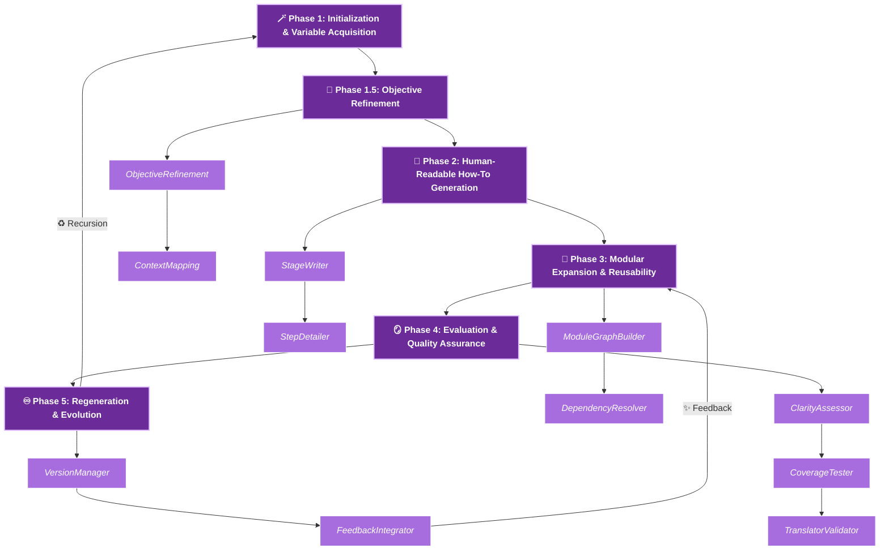

# Recursive_Grimoire_ v1.13.0 
## AI Instructional Workflow Generator


#             

---

## Table of Contents

### 1. [Overview](#overview)
### 2. [Design Philosophy](#design-philosophy)
### 4. [Core Features](#core-features)
### 5. [How It Works](#how-it-works)
### 6. [Example Templates](#example-templates)
### 7. [Operational Workflow](#operational-workflow)
### 8. [Intended Users](#intended-users)
### 9. [Technology Stack](#technology-stack)
### 10. [Setup & Usage](#setup--usage)
### 11. [Future Enhancements](#future-enhancements)
### 12. [Contributing](#contributing)
### 13. [License](#license)
### 14. [Contact](#contact)

---

# Overview

## Recursive_Grimoire_ v1.13.0 — AI Instructional Workflow Generator

            

---

# Table of Contents

1. [Overview](#overview)
2. [Design Philosophy](#design-philosophy)
3. [System Architecture](#system-architecture)
4. [Core Features](#core-features)
5. [How It Works](#how-it-works)
6. [Example Templates](#example-templates)
7. [Operational Workflow](#operational-workflow)
8. [Intended Users](#intended-users)
9. [Technology Stack](#technology-stack)
10. [Setup & Usage](#setup--usage)
11. [Future Enhancements](#future-enhancements)
12. [Contributing](#contributing)
13. [License](#license)
14. [Contact](#contact)

---

# Overview

**Recursive_Grimoire_ v1.13.0** is a **meta-educational AI system** that conjures, evaluates, and evolves **instructional workflows** automatically. It functions both as a *teacher* and a *scribe*, translating user intent into self-contained learning frameworks that recursively generate new instructions for humans or AI agents. Each workflow is a **grimoire of knowledge**, structured with packages for modules, tasks, dependencies, and logic sequences, capable of **recursive self-expansion**, meaning capable of learning from it's own output, and capable of teaching other AI as well. These workflows are designed to be flexible and adaptable, allowing for continuous improvement and the creation of new knowledge domains. The system's ability to learn and evolve, while retaining the 'domain_grimoire' knowledge-base that it provides itself, ensures that the generated instructions remain relevant and effective over time, making it a powerful tool for both educators and learners.

---

# Design Philosophy
> "Each workflow teaches the next workflow how to teach."
Here's an elaboration:

The design philosophy emphasizes the iterative nature of the system. Each generated workflow is not just a static product but a stepping stone for the next, continuously refining the teaching process. This is achieved through the system's ability to learn from its own outputs, adapt to new information, and evolve its instructional strategies. The inspiration drawn from ancient grimoires adds a layer of depth, suggesting that the system not only uses AI reasoning but also incorporates elements of knowledge preservation and symbolic representation, characteristic of these historical texts. The end result is a system that produces workflows that are both effective and adaptable, capable of generating new knowledge and improving pedagogical approaches over time.

---

# System Architecture

## Root Level Files

.editorconfig, .gitignore → Standard project configuration and exclusions.

README.md, CHANGELOG.md, LICENSE, CODE_OF_CONDUCT.md, CONTRIBUTING.md, SECURITY.md → Documentation, legal, and contribution policies.

pyproject.toml, REQUIREMENTS.txt → Dependency and build management.

make_repo_zip_instructions.txt → Auxiliary instructions for packaging the repository.

Clean root structure; contains all meta-information needed for contributors, license compliance, and dependency management.


## Core Modules

ai_core/ → Main orchestration code: handles workflow logic, module management, and recursive control. Contains:

dependency_graph.py → DAG management of workflow modules.

evolution_tracker.py → Tracks versioned changes and iterative evolution.

module_library.py → Stores and manages reusable modules.

workflow_io.py → Handles JSON/YAML input-output.

visualizer.py → Optional visual rendering of workflows.

ai_recursive/ → Contains recursive generation routines for self-improving workflows.

ai_validation/ → Validation scripts and JSON schemas for workflow/module correctness.

ai_evaluation/ → Metrics scripts assessing clarity, coverage, and AI-readability.

ai_visualization/ → Tools for Graphviz and diagram exports.

ai_monitoring/ → Logging, workflow event tracking, and observability.

ai_graph/ →  An auxiliary directory for graph-based workflow computations.

ai_memory/ → Persistent storage and version history of workflows for traceable lineage.


## Supporting Folders

generator/ → CLI scripts and entry points (main.py, cli.py, utils.py) to invoke the generator.

data/templates/ → Archetypal JSON templates: training, technical, creative, and meta-reflection workflows.

data/workflows/ → Output directory for generated workflows.

docs/ → Documentation: architecture, module references, **Grimoire** library”.

modules/ → Individual atomic modules callable by the generator.

meta_knowledge_repo/ → Stores metadata, logs, and AI learning history.

schemas/ → JSON schemas for module and workflow structure enforcement.

scripts/ → Utility scripts for maintenance, deployment, and testing.

tests/ → pytest-based unit and integration tests.

build/ → Graph and visualization artifacts, e.g., .dot and .png files.

docker/ → Optional containerization for reproducibility.

config/ → Configuration files (environment, runtime, paths).


## Summary

### Modularity: 
Clear separation between orchestration (ai_core), evaluation (ai_evaluation), validation (ai_validation), memory (ai_memory), and visualization (ai_visualization).

### Recursive Design: 
ai_recursive and meta_knowledge_repo indicate self-learning and iterative improvement.

### Human/Machine Readability: 
data/templates/ and data/workflows/ support dual output for humans (Markdown/YAML) and machines (minified JSON).

### Extensibility: 
modules/ and schemas/ allow adding new tasks or workflow types.

### Operational Transparency: 
logs/, ai_monitoring/, and docs/ ensure traceability and maintainability.

### Deployment-Ready: 
generator/, docker/, build/ support CLI use, reproducibility, and visualization.


## Each major folder serves a specific role in the full pipeline:

### Input acquisition → generator/ + ai_core/

### Workflow assembly → modules/ + schemas/

### Validation & evaluation → ai_validation/ + ai_evaluation/

### Storage & memory → ai_memory/ + meta_knowledge_repo/

### Visualization → ai_visualization/ + build/

### Observability → ai_monitoring/ + logs/

### Documentation → docs/ + templates

This structure supports recursive, self-improving workflows with full versioning, validation, and human/A.I.-readable outputs, making it a robust framework for instructional AI systems.

---
# Core Features

* **Recursive Workflow Generation** — Every output can seed future workflows.
* **Bimodal Representation** — Markdown for humans; minified JSON for machines.
* **Dependency Graph DAG** — Visualizes module interconnections and avoids conflicts.
* **Schema-Driven Validation** — Maintains logical consistency across all phases.
* **Persistent Memory System** — Archives all outputs with full version history.
* **Self-Evaluative Feedback Loop** — Evaluates clarity, coverage, and AI interpretability.
* **Visual Export** — Graphviz diagrams for human inspection of workflow dependencies.
* **Structured Logging** — Tracks all generation events in `logs/workflow.log`.
* **Mystical Submodule Layering** — Optional arcane-themed modules for readability (~30% theme).

---

# How It Works

1. **Invocation** — User specifies workflow purpose, audience, and style.
2. **Phase Generation** — `generator/main.py` constructs the **six-phase workflow**:

   * **Phase 1:** Initialization & Variable Acquisition
   * **Phase 1.5:** Objective Refinement (abstract → measurable goals)
   * **Phase 2:** Human-Readable How-To Generation
   * **Phase 3:** Modular Expansion & Reusability
   * **Phase 4:** Evaluation & Quality Assurance
   * **Phase 5:** Regeneration & Evolution
3. **Validation** — Schema verification ensures completeness, dependency integrity, and naming uniqueness.
4. **Evaluation** — Metrics measure clarity, coverage, expansion potential, and AI translatability.
5. **Reflection & Regeneration** — Versioning, minified JSON export, and recursive self-improvement loops.

---

# Operational Workflow


---
---

# Example Templates

| Template                            | Focus         | Primary Use                              |
| ----------------------------------- | ------------- | ---------------------------------------- |
| `training_curriculum_template.json` | Education     | Build structured learning programs       |
| `technical_procedure_template.json` | Engineering   | Standardize technical workflows          |
| `creative_writing_template.json`    | Arts          | Generate literary or narrative workflows |
| `meta_reflection_template.json`     | Metacognition | Evaluate and evolve cognitive frameworks |

---

# Intended Users

* **AI Developers** — Explore recursive instructional AI.
* **Educators & Trainers** — Auto-generate curriculum structures.
* **Writers & Designers** — Create recursive creative frameworks.
* **Research Institutions** — Investigate AI-guided pedagogy and meta-learning.

---

# Technology Stack

* Python 3.10+
* JSON + Markdown hybrid architecture
* Graphviz (optional) for visualization
* pytest for validation testing
* Custom AI reasoning modules (planned)

---

# Setup & Usage

### Clone Repository

```bash
git clone https://github.com/Tommy-Raven/AI_instructions_workflow.git
cd AI_instructions_workflow
```

### Install Dependencies

```bash
pip install -r requirements.txt
```

### Run CLI

```bash
python cli.py --purpose "Design an AI ethics curriculum"
```

### View Results

* **Generated JSON:** `data/workflows/`
* **Logs:** `logs/workflow.log`
* **Optional .dot Graph:** `build/workflow_graph.dot`

---

# Future Enhancements

* Adaptive semantic embeddings for self-learning
* Domain-specific plugin grimoires
* Multi-agent recursive co-generation
* Interactive dashboard visualization
* Open LLM integration for semantic workflow synthesis
* Automatic derivative workflow generation with lineage tracking

---

# Contributing
** see:_/CONTRIBUTING.md_ **

Submit issues or pull requests via GitHub.

---

# License

Proprietary — Research Phase.
All rights reserved © 2025 Tommy Raven / Raven Recordings

---

# Contact

* **Author:** Tommy Raven
* **Email:** GitHub Issues Preferred
* **Codename:** Recursive_Grimoire_ v1.13.0
* **Repository:** [github.com/Tommy-Raven/AI_instructions_workflow](https://github.com/Tommy-Raven/AI_instructions_workflow)

