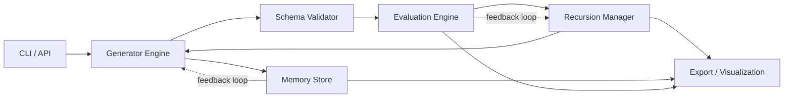
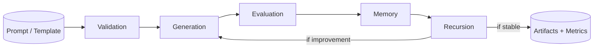

Version: 1.0 (Canonical Architecture)
Last Updated: 2025-05-19
Applies to: (sswg: minimum viable model) sswg-mvm-1.x

Status: Living document aligned to repository state

# SSWG-MVM Architecture

## Scope
This document describes the canonical architecture of the SSWG-MVM system as implemented in the SSWG-mvm1.0 repository.

It is intentionally code-first: all diagrams, subsystems, and execution flows reference real files and directories present in the repository. This document serves simultaneously as:
- a developer onboarding reference,
- a production architecture specification,
- and a research-grade system description.

---

## System Definition
SSWG-MVM (Synthetic Synthesist of Workflow Generation — Minimum Viable Model) is a schema-governed workflow generation and refinement system featuring:
- deterministic pipeline execution,
- formal validation against versioned schemas,
- semantic and quality evaluation,
- recursive refinement and expansion,
- memory-driven feedback loops,
- versioned lineage and diff tracking,
- visualization and export of artifacts,
- and reproducible execution via CI and environment locking.

---

## Subsystem Map (Responsibility Boundaries)

### Entry Surfaces
Provides user-facing and developer-facing invocation points.

- CLI:
  - [cli/cli.py](../cli/cli.py)
  - [ai_core/cli.py](../ai_core/cli.py)
  - [config/cli.py](../config/cli.py)
- Scripts / Utilities:
  - [scripts/main.py](../scripts/main.py)
  - [scripts/local_ci.py](../scripts/local_ci.py)
  - [scripts/check_templates.py](../scripts/check_templates.py)
  - [scripts/create_issues_from_json.py](../scripts/create_issues_from_json.py)

---

### Core Orchestration
Orchestrates cross-module phase execution, dependency resolution, and workflow lifecycle control.

- [ai_core/orchestrator.py](../ai_core/orchestrator.py)
- [ai_core/phase_controller.py](../ai_core/phase_controller.py)
- [ai_core/workflow.py](../ai_core/workflow.py)
- [ai_core/dependency_graph.py](../ai_core/dependency_graph.py)
- [ai_core/module_registry.py](../ai_core/module_registry.py)

---

### Generator Pipeline
Executes the primary MVM workflow: validation, generation, evaluation, recursion, export, and history tracking.

- [generator/main.py](../generator/main.py)
- [generator/workflow.py](../generator/workflow.py)
- [generator/modules.py](../generator/modules.py)
- [generator/exporters.py](../generator/exporters.py)
- [generator/history.py](../generator/history.py)
- [generator/utils.py](../generator/utils.py)
- [generator/performance_tracker.py](../generator/performance_tracker.py)

#### Recursion & Expansion
Controls recursion depth, triggers expansion when signals are weak, and routes refined workflows back through the generator.
- [generator/recursion_manager.py](../generator/recursion_manager.py)
- [generator/recursive_expansion.py](../generator/recursive_expansion.py)

#### Semantic & Evaluation Hooks
Provides semantic analysis and scoring hooks that guide generator decisions and highlight phases needing refinement.
- [generator/evaluation.py](../generator/evaluation.py)
- [generator/semantic_scorer.py](../generator/semantic_scorer.py)

---

### Evaluation & Metrics
Quantifies workflow quality and semantic improvement to guide recursion decisions.

- [ai_evaluation/evaluation_engine.py](../ai_evaluation/evaluation_engine.py)
- [ai_evaluation/quality_metrics.py](../ai_evaluation/quality_metrics.py)
- [ai_evaluation/scoring_adapter.py](../ai_evaluation/scoring_adapter.py)
- [ai_evaluation/semantic_analysis.py](../ai_evaluation/semantic_analysis.py)

---

### Graph & Dependency Intelligence
Resolves dependencies, recursive flows, and semantic relationships between workflow components.

- [ai_graph/dependency_mapper.py](../ai_graph/dependency_mapper.py)
- [ai_graph/recursive_flow_graph.py](../ai_graph/recursive_flow_graph.py)
- [ai_graph/semantic_network.py](../ai_graph/semantic_network.py)

---

### Memory / Feedback / Benchmarks
Persists snapshots, metrics, anomalies, and historical signals to enable adaptive behavior.

- [ai_memory/memory_store.py](../ai_memory/memory_store.py)
- [ai_memory/feedback_integrator.py](../ai_memory/feedback_integrator.py)
- [ai_memory/anomaly_detector.py](../ai_memory/anomaly_detector.py)
- [ai_memory/benchmark_tracker.py](../ai_memory/benchmark_tracker.py)

---

### Recursive Evolution / Version Control
Manages semantic diffs, variant generation, and lineage-aware workflow evolution.

- [ai_recursive/version_control.py](../ai_recursive/version_control.py)
- [ai_recursive/version_diff_engine.py](../ai_recursive/version_diff_engine.py)
- [ai_recursive/merge_engine.py](../ai_recursive/merge_engine.py)
- [ai_recursive/variant_generator.py](../ai_recursive/variant_generator.py)
- [ai_recursive/memory_adapter.py](../ai_recursive/memory_adapter.py)

---

### Validation / Schema Governance
Enforces structural correctness and manages schema evolution across versions.

- [ai_validation/schema_validator.py](../ai_validation/schema_validator.py)
- [ai_validation/schema_tracker.py](../ai_validation/schema_tracker.py)
- [ai_validation/version_migrator.py](../ai_validation/version_migrator.py)
- [ai_validation/regression_tests.py](../ai_validation/regression_tests.py)
- [ai_validation/template_regression_tests.py](../ai_validation/template_regression_tests.py)

---

### Visualization & Export
Translates internal state into human-readable diagrams and artifacts.

- [ai_visualization/export_manager.py](../ai_visualization/export_manager.py)
- [ai_visualization/mermaid_generator.py](../ai_visualization/mermaid_generator.py)
- [ai_visualization/graphviz_adapter.py](../ai_visualization/graphviz_adapter.py)
- [ai_visualization/markdown_importer.py](../ai_visualization/markdown_importer.py)

---

### Schemas (Contracts)
Defines the canonical structural and semantic contracts for workflows.

- [schemas/workflow_schema.json](../schemas/workflow_schema.json)
- [schemas/module_schema.json](../schemas/module_schema.json)
- [schemas/phase_schema.json](../schemas/phase_schema.json)
- [schemas/recursion_schema.json](../schemas/recursion_schema.json)
- [schemas/evaluation_schema.json](../schemas/evaluation_schema.json)
- [schemas/semantics_schema.json](../schemas/semantics_schema.json)
- [schemas/metadata_schema.json](../schemas/metadata_schema.json)
- [schemas/ontology_schema.json](../schemas/ontology_schema.json)
- [schemas/template_schema.json](../schemas/template_schema.json)

---

### LLM Adapter Layer
Abstracts model inference, enabling integration with local or API-based LLMs for refinement and meta-generation.

- [modules/llm_adapter.py](../modules/llm_adapter.py)

This layer allows SSWG-MVM to remain model-agnostic while supporting LLM-in-the-loop recursion, bridging to any local runtime or remote API for targeted refinements or meta-generation passes.

---

### Reproducibility & Packaging
Locks environments and execution conditions for replicable results.

- [reproducibility/*](../reproducibility)
- [docker/Dockerfile](../docker/Dockerfile)
- [pyproject.toml](../pyproject.toml)
- [REQUIREMENTS.txt](../REQUIREMENTS.txt)

---

### Proof & Validation
Ensures correctness, regression safety, and execution stability.

- [tests/test_generator_main.py](../tests/test_generator_main.py)
- [tests/test_recursion.py](../tests/test_recursion.py)
- [tests/test_semantics.py](../tests/test_semantics.py)
- [tests/test_templates.py](../tests/test_templates.py)
- [tests/test_versioning.py](../tests/test_versioning.py)
- additional unit and integration tests under [tests/](../tests)

---

## Core Recursion Loop (Runtime Flow)

<svg aria-label="Core recursion loop" role="img" viewBox="0 0 900 360" xmlns="http://www.w3.org/2000/svg">
  
  <defs>
    <marker id="arrowhead" markerWidth="10" markerHeight="8" refX="7" refY="4" orient="auto" markerUnits="strokeWidth">
      <path d="M0,0 L10,4 L0,8 Z" fill="#3b5ad0" />
    </marker>
  </defs>
  <rect class="node" x="30" y="40" width="140" height="50" />
  <text x="100" y="70" text-anchor="middle">CLI / API</text>

  <rect class="node" x="200" y="40" width="160" height="50" />
  <text x="280" y="70" text-anchor="middle">Generator Engine</text>

  <rect class="node" x="420" y="40" width="150" height="50" />
  <text x="495" y="70" text-anchor="middle">Schema Validator</text>

  <rect class="node" x="620" y="40" width="160" height="50" />
  <text x="700" y="70" text-anchor="middle">Evaluation Engine</text>

  <rect class="node" x="420" y="200" width="170" height="50" />
  <text x="505" y="230" text-anchor="middle">Recursion Manager</text>

  <rect class="node" x="200" y="200" width="150" height="50" />
  <text x="275" y="230" text-anchor="middle">Memory Store</text>

  <rect class="node" x="620" y="200" width="180" height="50" />
  <text x="710" y="230" text-anchor="middle">Export / Visualization</text>

  <line class="arrow" x1="170" y1="65" x2="200" y2="65" />
  <line class="arrow" x1="360" y1="65" x2="420" y2="65" />
  <line class="arrow" x1="570" y1="65" x2="620" y2="65" />
  <line class="arrow" x1="700" y1="90" x2="505" y2="200" />
  <line class="arrow" x1="505" y1="250" x2="275" y2="250" />
  <line class="arrow" x1="350" y1="225" x2="420" y2="225" />
  <line class="arrow" x1="505" y1="250" x2="505" y2="90" />
  <line class="arrow" x1="505" y1="250" x2="620" y2="225" />
  <line class="arrow" x1="355" y1="65" x2="245" y2="200" />
  <line class="arrow dashed" x1="275" y1="200" x2="275" y2="90" />
  <line class="arrow dashed" x1="700" y1="90" x2="700" y2="200" />

  <text x="250" y="185" text-anchor="middle" fill="#9b59b6">feedback loop</text>
  <text x="730" y="185" text-anchor="middle" fill="#9b59b6">feedback loop</text>
</svg>

Runtime Order
-------------
1. CLI or API triggers [`generator/main.py`](../generator/main.py).
2. `generator` loads the workflow via [`ai_core/orchestrator.py`](../ai_core/orchestrator.py).
3. [`ai_validation/schema_validator.py`](../ai_validation/schema_validator.py) ensures structural validity.
4. [`ai_evaluation/evaluation_engine.py`](../ai_evaluation/evaluation_engine.py) scores the workflow (clarity, expandability).
5. [`generator/recursion_manager.py`](../generator/recursion_manager.py) decides:
   - if Δscore < threshold → stop
   - else → invoke [`modules/llm_adapter.py`](../modules/llm_adapter.py) / [`generator/recursive_expansion.py`](../generator/recursive_expansion.py).
6. [`ai_memory/feedback_integrator.py`](../ai_memory/feedback_integrator.py) logs metrics → [`ai_memory/memory_store.py`](../ai_memory/memory_store.py).
7. [`ai_visualization/export_manager.py`](../ai_visualization/export_manager.py) + visualization emit updated artifacts.

---

## Alignment Guarantees
- All subsystems correspond to real paths in the repository.
- No speculative modules are required for correctness.
- Any architectural change must update this document to remain canonical.
---

## Directory & File Mapping

* [`ai_core/`](../ai_core) — Orchestration and workflow phases
* [`ai_recursive/`](../ai_recursive) — Recursive generation, merging, memory, evaluation, registry
* [`ai_memory/`](../ai_memory) — Persistent workflow storage and metrics
* [`ai_evaluation/`](../ai_evaluation) — Quality assessment and feedback loops
* [`generator/`](../generator) — CLI and entry points
* [`data/`](../data) — Templates and generated workflows
* [`schemas/`](../schemas) — JSON schema validation
* [`constitution/`](../constitution) — Rulebook enforcement
* [`contradiction/`](../contradiction) — Conflict detection and auto-remediation
* [`reproducibility/`](../reproducibility) — Deterministic execution
* [`safety/`](../safety) — Sanitization, classification, sandbox simulation
* [`web/`](../web) — FastAPI interface
* [`tests/`](../tests) — Automated testing

---

## Design Principles

* **Modularity:** Clear separation of orchestration, evaluation, validation, memory, and visualization
* **Recursive Design:** Self-learning workflows with iterative improvement
* **Traceable Outputs:** Versioned, archived, and human/machine-readable
* **Integration-Ready:** Seamless interaction with safety, constitution, and risk pipelines
* **Deployment-Ready:** CLI, containerization, and visualization support

---

## Runtime Data Flow (Self-Improving Loop)

<svg aria-label="Runtime data flow" role="img" viewBox="0 0 900 220" xmlns="http://www.w3.org/2000/svg">
  
  <defs>
    <marker id="arrow2" markerWidth="10" markerHeight="8" refX="7" refY="4" orient="auto" markerUnits="strokeWidth">
      <path d="M0,0 L10,4 L0,8 Z" fill="#2f855a" />
    </marker>
  </defs>
  <rect class="node" x="20" y="70" width="150" height="50" />
  <text x="95" y="100" text-anchor="middle">Prompt / Template</text>

  <rect class="node" x="190" y="70" width="120" height="50" />
  <text x="250" y="100" text-anchor="middle">Validation</text>

  <rect class="node" x="340" y="70" width="120" height="50" />
  <text x="400" y="100" text-anchor="middle">Generation</text>

  <rect class="node" x="490" y="70" width="120" height="50" />
  <text x="550" y="100" text-anchor="middle">Evaluation</text>

  <rect class="node" x="640" y="70" width="110" height="50" />
  <text x="695" y="100" text-anchor="middle">Memory</text>

  <rect class="node" x="640" y="150" width="180" height="50" />
  <text x="730" y="180" text-anchor="middle">Artifacts + Metrics</text>

  <rect class="node" x="800" y="70" width="80" height="50" />
  <text x="840" y="100" text-anchor="middle">Recursion</text>

  <line class="arrow" x1="170" y1="95" x2="190" y2="95" />
  <line class="arrow" x1="310" y1="95" x2="340" y2="95" />
  <line class="arrow" x1="460" y1="95" x2="490" y2="95" />
  <line class="arrow" x1="610" y1="95" x2="640" y2="95" />
  <line class="arrow" x1="750" y1="95" x2="800" y2="95" />
  <line class="arrow" x1="840" y1="120" x2="840" y2="150" />
  <line class="arrow" x1="800" y1="80" x2="460" y2="60" />
  <text x="650" y="60" text-anchor="middle">if improvement</text>
  <text x="840" y="140" text-anchor="middle">if stable</text>
</svg>

---

## Evolution Plan

Planned Module / Location / Purpose:

- [`ai_reasoning/`](../ai_reasoning) — future: hybrid reasoning + semantic embedding management
- [`ai_alignment/`](../ai_alignment) — future: reward tuning + policy alignment
- [`modules/agent_bridge.py`](../modules/agent_bridge.py) — planned: connect multi-agent LLM orchestrations
- [`meta_governance/`](../meta_governance) — roadmap: formal recursion policy + safety constraints

