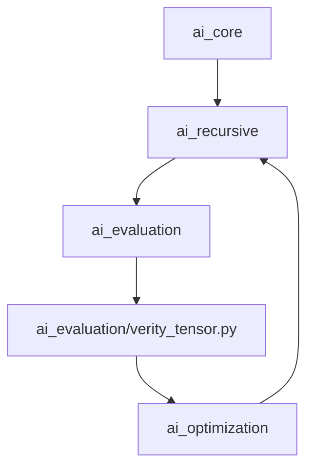

# 🕸 Module Graph Architecture  

The SSWG-MVM system models all workflows as **Directed Acyclic Graphs (DAGs)**.  
These encode task dependencies, logical flow, and expansion structure.

---

# 📐 DAG Rules

1. **Every node is a Phase ID**
   Example: `"P1"`, `"P1.2"`, `"P3"`

2. **Edges cannot form cycles**
   - MVM will attempt autocorrection  
   - If not possible, it logs warnings + notes in evaluation

3. **Nodes must appear exactly once**
   - No duplicate phase IDs  

4. **All referenced dependencies must exist**
   - Autocorrect inserts missing nodes if needed

---

# 🧩 DependencyGraph API

The class lives in:

```
ai_graph/dependency_mapper.py
```

### Responsibilities

- Build graph from workflow modules  
- Detect cycles  
- Autocorrect missing edges  
- Provide structure for visualization  

---

# 📊 Mermaid Output (Example)

```
flowchart TD
  P1 --> P2
  P2 --> P3
  P3 --> P4
```

Generated automatically from:

```python
from ai_visualization.mermaid_generator import mermaid_from_workflow
```

---

# 🔧 Autocorrect Features

### 1. Missing dependency
If a phase references a missing parent:

```
P4 depends on missing P2.1
```

MVM inserts a stub:

```
{ "id": "P2.1", "title": "Auto-generated placeholder", ... }
```

### 2. Circular dependency
If the graph contains:

```
P3 → P4 → P3
```

MVM attempts:

- Reverse 1 edge  
- Or duplicate the weaker phase  

If still not possible → workflow flagged.

---

# 🧠 DAG Use in Refinement

The recursive engine uses the graph to:

- detect weak connectivity  
- reorder phases  
- detect “dead-end” phases  
- enforce increasing granularity from P1 → Pn

---

# 🧠 Optimization + Verity Nodes (v1.2.0)

The module graph now includes optimization and verity tensor nodes that feed recursion decisions:



These nodes ensure optimization telemetry and verity signals feed back into the recursion loop.
