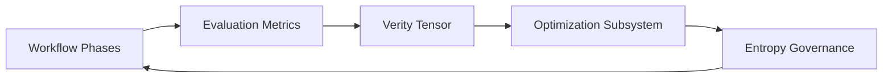

---
anchor:
  anchor_id: docs_architecture_workflow_structure
  anchor_version: "1.0.0"
  scope: docs
  owner: sswg
  status: draft
---

# 📜 Workflow Structure Specification

SSWG-MVM workflows follow a strict, schema-aligned structure.

---

# 🧩 Required Top-Level Fields

| Field | Type | Description |
|------|------|-------------|
| `workflow_id` | string | Unique identifier |
| `version` | string | Schema version (e.g. `v.09.mvm.25`) |
| `metadata` | object | Purpose, audience, author, created |
| `phases` | array | Ordered list of phases |
| `dependency_graph` | object | DAG representation |
| `evaluation` | object | Optional metrics |

---

# Phase Object Structure

Each phase looks like:

```json
{
  "id": "P1",
  "title": "Initialization",
  "tasks": [
    "Set objective",
    "Collect context"
  ],
  "ai_task_logic": "Explain what AI should do in this phase.",
  "human_actionable": "Explain what a human would do."
}
```

---

# 📐 Constraints

### ✔ IDs must be unique  
### ✔ Titles required  
### ✔ Tasks must be an array of strings  
### ✔ ai_task_logic required  
### ✔ human_actionable required  

---

# 🧱 Example Valid Workflow

```
workflow_id: "workflow_98f20ab4_20251203"
version: "v.09.mvm.25"

metadata:
  purpose: "Technical instruction generation"
  audience: "Developers"
  author: "Tommy Raven"
  created: "2025-12-03T20:01:22Z"

phases:
  - id: P1
    title: Initialization
    tasks:
      - Identify goals

dependency_graph:
  nodes: ["P1"]
  edges: []
```

---

# 📦 Exported Artifacts

MVM generates:

| Type | File |
|------|------|
| JSON | `workflow_id.json` |
| Markdown | `workflow_id.md` |
| Mermaid | Embedded inside Markdown |

---

# 🔁 Optimization + Entropy Signal Flow



This flow keeps workflow structure aligned with optimization telemetry and bounded cognition gates.
