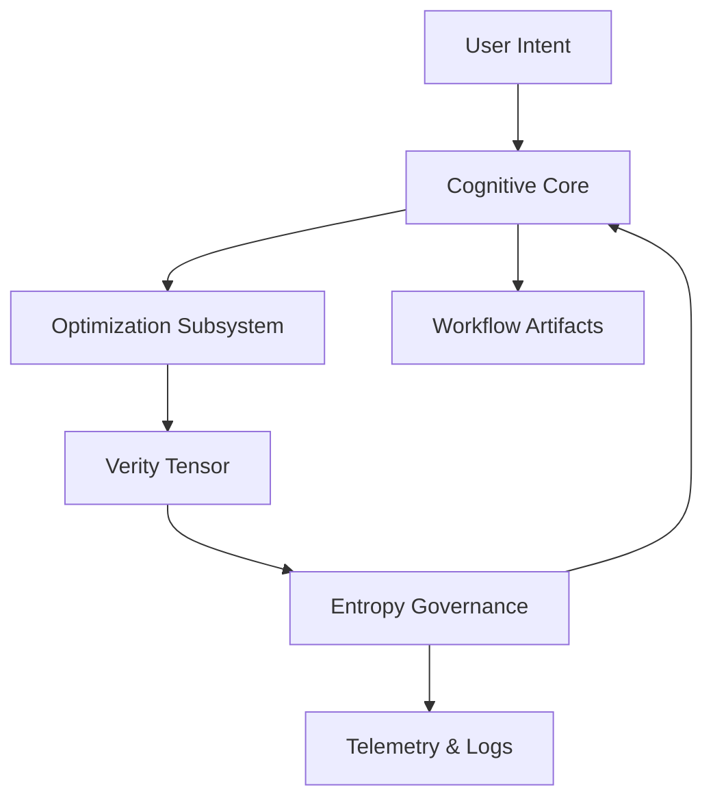
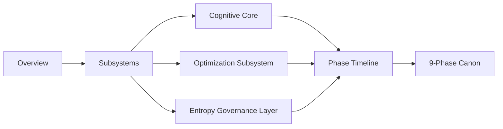

> ⚠️ DEPRECATED — NON-AUTHORITATIVE
>
> This document is NOT canonical.
> It SHALL NEVER be used as a source of governance.
> Canonical governance will reside exclusively in `directive_core/docs/`.
> This file exists only for historical or migration reference.

---
anchor:
  anchor_id: docs_getting_started_overview
  anchor_version: "1.0.0"
  scope: docs
  owner: sswg
  status: draft
---

# Getting Started with SSWG-MVM

This section introduces the Minimum Viable Model for the Synthetic Synthesist of Workflow Generation (SSWG-MVM).  

## What is SSWG-MVM?

A modular, schema-enforced AI system that:

- converts abstract intent → structured workflow  
- enforces required metadata and dependency rules  
- recursively improves outputs  
- exports JSON + Markdown versions  
- logs lineage and metrics  

---

# Workflow Lifecycle

SSWG-MVM runs through:

1. **Loading**  
2. **Schema validation**  
3. **Dependency graph correction**  
4. **Evaluation**  
5. **Optional refinement**  
6. **Export**  
7. **History recording**

---

# Templates Overview

MVM ships with several templates in `data/templates/`:

- **creative_writing**
- **technical_procedure**
- **meta_reflection**
- **training_curriculum**

Each can be invoked using:

```bash
python3 -m generator.main --template creative
```

---

# Requirements

- Python 3.10+
- pip
- Linux/WSL/ChromeOS Debian (supported)

Recommended:

- VS Code  
- GitHub Desktop or terminal Git  
- Graphviz (optional)

---

# 🧠 System Summary (v1.2.0+)

sswg-mvm now describes its architecture as a **three-tier cognitive stack**:

1. **Cognitive Core** — schema-governed recursion, workflow synthesis, and phase enforcement.
2. **Optimization Subsystem** — deterministic tuning, ontology alignment, and verity-signal routing.
3. **Entropy Governance Layer** — bounded cognition controls, entropy budgets, and termination gates.

This tri-layer framing aligns the execution model with bounded cognition while preserving deterministic guarantees.

---

# 🔁 Execution Flow (Entropy-Governed)



**Notes:** The verity tensor is computed alongside optimization telemetry, then routed through entropy governance to determine whether recursion proceeds or halts.

---

# 📌 Phase Designation (Chronology)

- **v1.0.0** — Baseline recursion, schema enforcement, and deterministic evaluation.
- **v1.1.0** — Optimization subsystem and ontology-aware telemetry.
- **v1.2.0 (Bounded Cognition)** — Entropy-governed recursion and verity tensor convergence logic.

---

# 🧭 Core Philosophy — Cognitive Thermodynamics

sswg-mvm treats recursion as an energy system: each iteration spends cognitive energy to gain verity. The system halts when additional thought increases entropy faster than it increases verity, protecting coherence and determinism while preventing runaway refinement.

> **New Cognitive Law:**
> The sswg-mvm system operates under a bounded energy principle: cognition halts when additional thought increases entropy faster than verity.

---

# 🗺 Documentation Architecture Map



This map reflects the documentation structure from overview → subsystem detail → phase timeline, mirroring the bounded cognition architecture introduced in v1.2.0.
